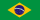
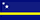
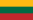

# world-of-mlb
2018 MLB Roster by birth countries


Build using [daigofuji/jekyll-foundation-6-starter](http://daigofuji.github.io/jekyll-foundation-6-starter/)

For Dev:
```
npm start
bundle exec jekyll serve --watch
```

(Run this once:
  `npm install` and `bundle install`)


## Countries

Australia
Aruba 
Brazil
Canada
Colombia
Cuba
Curacao
Germany
Dominican Republic
United Kingdom
Guam
Hong Kong
Japan
South Korea
Lithuania
Mexico
Nicaragua
Netherlands
Panama
Puerto Rico
Saudi Arabia
Taiwan
United States
Venezuela
U. S. Virgin Islands
South Africa